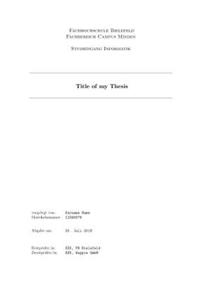
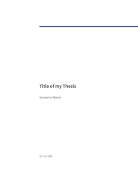
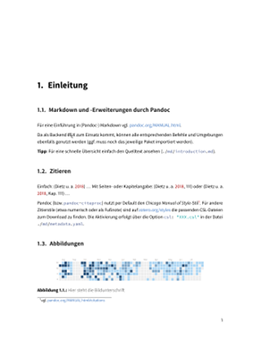
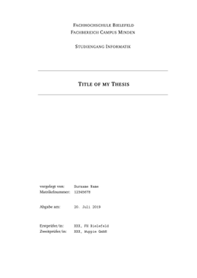

# pandoc-thesis

A Template for Thesis Documents written in Markdown


## Installation

### Docker (recommended)

1.  Install docker from <https://hub.docker.com/search/?type=edition&offering=community>
2.  Build docker image containing all dependencies, e.g. pandoc and TeX Live: `make docker`

**Note**: You will need about 2GB of free disk space:
```
$ docker image ls
REPOSITORY          TAG                 IMAGE ID            CREATED             SIZE
pandoc-thesis       latest              9b8e245781ab        3 days ago          1.98GB
debian              stable-slim         b861b2eb769f        11 days ago         69.2MB
```

### Alternative Route

1.  Install pandoc from <https://pandoc.org/>
2.  You also need to install LaTeX, e.g. from <https://www.tug.org/texlive/>
3.  Install packages needed by pandoc: <https://pandoc.org/MANUAL.html#creating-a-pdf>
4.  Either set an environment variable `PANDOC` pointing to the location of your pandoc installation or change in the
    line `PANDOC      ?= docker run --rm -v $(PWD):/pandoc pandoc-thesis pandoc` in the [`Makefile`](Makefile) to reflect
    your settings

### Additional Templates

*   Eisvogel: For using the [Eisvogel template](https://github.com/Wandmalfarbe/pandoc-latex-template), download the latest
    version of the template [`eisvogel.tex`](https://github.com/Wandmalfarbe/pandoc-latex-template/blob/master/eisvogel.tex)
    and move it to the project folder
    (**Note**: Latest tested commit is [`36e92c5eeb`](https://github.com/Wandmalfarbe/pandoc-latex-template/blob/36e92c5eebb95219de737c6afa7c464bc87b872e/eisvogel.tex).)
*   Clean Thesis: For using the [Clean Thesis template](https://github.com/derric/cleanthesis), download the latest version
    of the template [`cleanthesis.sty`](https://github.com/derric/cleanthesis/blob/master/cleanthesis.sty) and move it to the
    project folder
    (**Note**: Latest tested commit is [`c4609c4c70`](https://github.com/derric/cleanthesis/blob/c4609c4c70d718876c3cbf7aa46d80b26299612e/cleanthesis.sty).)

**Note**: If the template files do not yet exist in the project folder, `make eisvogel` and/or `make cleanthesis` will download them.


## Usage Example

1.  Maintain your references in [`references.bib`](references.bib)
2.  Put the title of your thesis, your name and other meta information in [`md/metadata.yaml`](md/metadata.yaml)
3.  Adjust optional definitions in [`md/metadata.yaml`](md/metadata.yaml) to your needs:
    -   Disable extras like `abstract-*` or `acknowledgements` or `restrictionnote`: Remove or comment this optional definitions
    -   Modify content (text) of optional definitions like `abstract-*` or `acknowledgements` or `restrictionnote`
    -   If you like Eisvogel but want a more useful`^W`conventional page header (i.e. chapter/section instead of the thesis title) activate (i.e. remove comment in front of) `headeralternative`
4.  Fill the markdown files under [`md/`](md) with your content
    *   The default files in the folder [`md/`](md) correspond to a typical structure of a scientific thesis (see also
        `@Balzert2017`: *Balzert et al.* "Wissenschaftliches Arbeiten", Springer, 2017). You can just use this as starting
        point for your work ...  *Hint*: You will find some help regarding the use of Markdown in
        [`md/introduction.md`](md/introduction.md) as well as typical number of pages for each chapter in the comment section
        of each file.
    *   In case you see need for an other layout, please do not forget to reflect the changed filenames in [`Makefile`](Makefile).
5.  Build the thesis:
    *   Using the simple layout: `make simple`
    *   Using Eisvogel: `make eisvogel`
    *   Using Clean Thesis: `make cleanthesis`
6.  Clean up:
    *   To remove temporary (generated) filed: `make clean`
    *   To also remove the generated thesis (PDF): `make distclean`

The above mentioned files constitute a minimal working example. To start your own project, simply clone this project and customize
the files mentioned above.

**Note**: *When switching between templates, please make sure to `make clean` first! Failing to do so may lead to strange behaviour
or even to weird errors.*


## Preview

### Example using *Simple* Layout

| Simple Titlepage                                                                                        | Simple Chapter                                                                                      |
|---------------------------------------------------------------------------------------------------------|-----------------------------------------------------------------------------------------------------|
| [](examples/thesis_example_simple.pdf) | [](examples/thesis_example_simple.pdf) |

### Example using *Eisvogel* Template

| Eisvogel Titlepage                                                                                            | Eisvogel Chapter                                                                                          |
|---------------------------------------------------------------------------------------------------------------|-----------------------------------------------------------------------------------------------------------|
| [](examples/thesis_example_eisvogel.pdf) | [](examples/thesis_example_eisvogel.pdf) |

### Example using *Clean Thesis* Template

| Clean Thesis Titlepage                                                                                                  | Clean Thesis Chapter                                                                                                |
|-------------------------------------------------------------------------------------------------------------------------|---------------------------------------------------------------------------------------------------------------------|
| [](examples/thesis_example_cleanthesis.pdf) | [](examples/thesis_example_cleanthesis.pdf) |


---

# License

Copyright (c) 2019, Carsten Gips

[MIT licensed](http://opensource.org/licenses/MIT)
